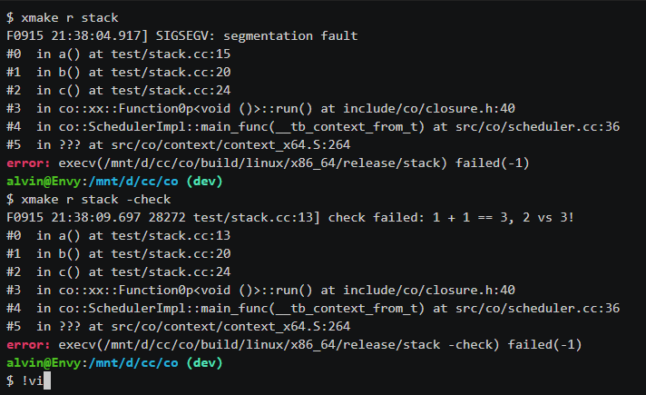

# Log

## 简介

流式日志库。支持两种类型的日志：

* **Level Log**：分 debug、info、warning、error 和 fatal 五种级别，fatal 日志打完后会终止程序运行并打印函数调用栈信息
* **Topic Log**：按照主题分类存储在不同的文件中，没有级别之分

## 调试

```bash
xmake -b log                   # build log or log.exe
xmake r log                    # run log or log.exe
xmake r log -cout              # also log to terminal
xmake r log -min_log_level=1   # 0-4: debug,info,warning,error,fatal 
xmake r log -perf              # performance test
```

## 用法

### 1. Level Log

```c++
// 不同级别的日志
DLOG << "this is DEBUG log " << 23;
LOG << "this is INFO log " << 23;
WLOG << "this is WARNING log " << 23;
ELOG << "this is ERROR log " << 23;
FLOG << "this is FATAL log " << 23;

// 条件日志
#define DLOG_IF(cond) if (cond) DLOG
#define  LOG_IF(cond) if (cond) LOG
#define WLOG_IF(cond) if (cond) WLOG
#define ELOG_IF(cond) if (cond) ELOG
#define FLOG_IF(cond) if (cond) FLOG

// 每隔 N 条打印一次日志
#define DLOG_EVERY_N(n) _LOG_EVERY_N(n, DLOG)
#define  LOG_EVERY_N(n) _LOG_EVERY_N(n, LOG)
#define WLOG_EVERY_N(n) _LOG_EVERY_N(n, WLOG)
#define ELOG_EVERY_N(n) _LOG_EVERY_N(n, ELOG)

// 打印前 N 条日志
#define DLOG_FIRST_N(n) _LOG_FIRST_N(n, DLOG)
#define  LOG_FIRST_N(n) _LOG_FIRST_N(n, LOG)
#define WLOG_FIRST_N(n) _LOG_FIRST_N(n, WLOG)
#define ELOG_FIRST_N(n) _LOG_FIRST_N(n, ELOG)
```

### 2. Topic Log

```c++
#define TLOG(topic)
#define TLOG_IF(topic, cond) if (cond) TLOG(topic)
```

### 3. 断言

断言失败时会调用 `log::exit()`，再打印当前线程的函数调用栈信息，然后退出程序。

```c++
#define CHECK(cond) \
    if (!(cond)) _FLOG_STREAM << "check failed: " #cond "! "

#define CHECK_NOTNULL(p) \
    if ((p) == 0) _FLOG_STREAM << "check failed: " #p " mustn't be NULL! "

#define CHECK_EQ(a, b) _CHECK_OP(a, b, ==)
#define CHECK_NE(a, b) _CHECK_OP(a, b, !=)
#define CHECK_GE(a, b) _CHECK_OP(a, b, >=)
#define CHECK_LE(a, b) _CHECK_OP(a, b, <=)
#define CHECK_GT(a, b) _CHECK_OP(a, b, >)
#define CHECK_LT(a, b) _CHECK_OP(a, b, <)
```

使用例子：

```c++
int s = socket();
CHECK(s != -1);
CHECK(s != -1) << "create socket failed";
CHECK_NE(s, -1) << "create socket failed";   // s != -1
CHECK_GE(s, 0) << "create socket failed";    // s >= 0
CHECK_GT(s, -1) << "create socket failed";   // s > -1

std::map<int, int> m;
auto it = m.find(3);
CHECK(it != m.end());  // 不能使用 CHECK_NE(it, m.end()), 编译器会报错
```

## 打印堆栈信息

在 CHECK 断言失败或者捕获到 SIGSEGV 等异常信号时会打印函数调用栈，以方便定位问题：



此功能需要在编译时加入调试信息（如 gcc 需要开启 -g 选项），另外还需要安装 libbacktrace 才能打印堆栈信息。在 Linux 上 libbacktrace 可能已经集成到 gcc 里了，可以在类似如下目录中找到它：

```bash
/usr/lib/gcc/x86_64-linux-gnu/9
```

否则你需要手动安装：

```bash
git clone https://github.com/ianlancetaylor/libbacktrace.git
cd libbacktrace-master
./configure
make -j8
sudo make install
```
