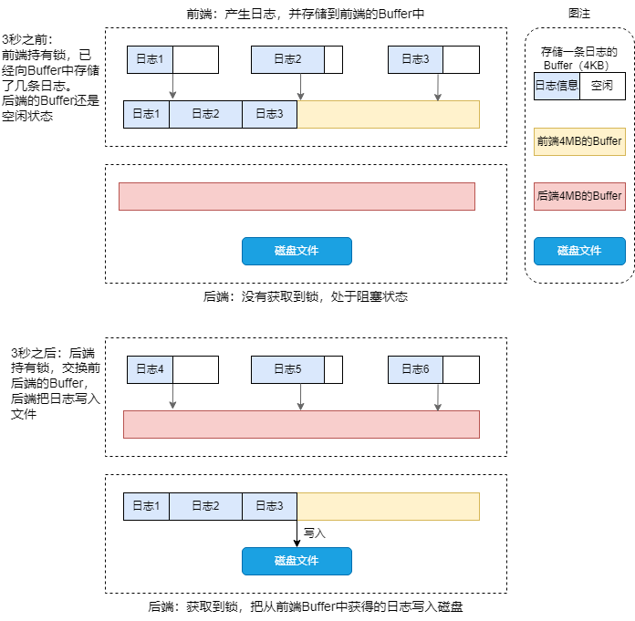

# Logger

## 功能需求

* 日志消息支持多种级别，如 TRACE、DEBUG、INFO、WARN、 ERROR 和 FATAL 等
* 日志级别在运行时可调，这样在必要时候可以临时在线调整日志的输出级别（例如服务压力过大时调整为 WARNING 级别较少日志数量，或者需要排查进程问题时调整为 DEBUG 级别打印更细节的日志）
* 分布式系统中的服务进程，日志的目的地（destination）只能是本地文件
* 支持日志滚动（rolling），既可以按照文件大小（每写满 1GB）又可以按照时间（每天零点新建日志文件）

## 性能需求

* 每秒写几千上万条日志的时候没有明显的性能损失
* 能应对一个进程产生大量日志数据的场景，例如 1GB / min
* 在多线程程序中不造成争用（contention）

## 设计点

### 1. 日志文件名

一个典型的日志文件名如下：

> logfile_test.20231019-150731.hostname.1537089.log

* `logfile_test`：进程名称，容易区分是哪个服务进程的日志
* `20231019-150731`：文件创建时间（GMT 时区）
* `hostname`：机器名称，这样即使把日志文件拷贝到其他机器也可以追溯其来源
* `1537089`：进程 ID，这样如果服务在短时间内反复重启就会生成多份日志文件
* `log`：统一的后缀，方便周边配套脚本的编写

### 2. 异步日志如何确保日志全部打印完

往文件中写日志的一个常见问题就是万一程序崩溃，那么最后若干条日志就会丢失。这是因为日志库不能每条消息都 flush 硬盘，更不能每条日志都 open / close 文件，这样性能开销太大。

muduo 日志库采用两个方法来应对这一点：

* 定期（默认三秒）将缓冲区日志 flush 到硬盘
* 在内存中的日志消息都带有 cookie（或者叫做哨兵值 sentry），其值为某个函数的地址，这样通过在 coredump 文件中查找 cookie 就可以找到尚未来得及写入到磁盘的日志消息

### 3. 日志格式

以下是 muduo 日志库的默认消息格式：

```bash
日期      时间     微秒    线程    级别   正文    源文件名        行号
20231019 15:20:41.180932Z 1553444 INFO  Hello - LogFile_test.cc:30
20231019 15:20:41.182015Z 1553444 WARN  World - LogFile_test.cc:30
20231019 15:20:41.183184Z 1553444 ERROR Error - LogFile_test.cc:30
```

日志格式具有如下要点：

* 尽量每条日志占一行，这样可以通过 awk、sed 和 grep 等命令行工具来快速联机分析日志。
* 时间戳精确到微秒，每条消息都通过 `gettimeofday(2)` 获取当前时间，这么做不会有什么性能损失（因为在 x86-64 Linux 上，gettimeofday(2) 不是系统调用不会陷入内核）
* 始终使用 GMT 时区（Z），对于跨州的分布式系统而言可以省去本地时区转换的麻烦（主要西方国家大多实行夏令时）
* 打印线程 ID，便于分析多线程时序
* 打印日志级别，线上 debug 时先看是否存在 ERROR 日志可以快速定位问题
* 打印源文件和行号

### 4. 双缓冲技术

正常情况下异步日志库会使用一个线程安全的 queue 将日志发送到后端日志线程，这样会导致每产生一条消息都通知（`notify()`）使用方。（因为一般会使用条件变量在消息队列为空时阻塞住）

双缓冲（double buffering）技术的基本思路是准备两块 Buffer，分别称为 A 和 B，前端负责往 buffer A 填数据（日志消息），后端负责将 buffer B 的数据写入文件。当 buffer A 写满后就交互 A 和 B，让后端将 buffer A 的数据写入文件而前端往 buffer B 中写入数据，如此反复。另外为了及时将日志消息写入文件，及时 buffer A 未满，日志库也会每 3 秒执行一次上述交换写入的操作。

这样做的好处有两个，一方面是当前端 buffer 写满后后端的空闲 buffer 能够立即与前端互换让前端可以继续往 buffer 中写入日志，而不必等到后端将日志全部写到文件后再释放锁，这样可以大大减小锁的粒度。另一方面是避免每条新日志都触发唤醒后端线程的操作，换言之前端并不是将一条条日志消息分别发送给后端，而是将多条消息拼接成一个大的 buffer 发送给后端，相当于批处理（**Batch 批攒思想是后端常见的优化手段**），减少了线程唤醒的频率从而降低开销。

以 3 秒落盘一次为例，日志双缓冲原理图如下：



实际 muduo 日志库前端和后端交互涉及到四个缓冲区 A、B、C 和 D，前端和后端各持有两个。另外前端和后端各有一个缓冲区数组，初始时都是空的。

#### 4.1 前端写日志频率不高

第一种情况是前端写日志频率不高，后端 3 秒超时后将 “当前缓冲区 current-buffer ”写入文件：


在第 2.9 秒时 current-buffer 使用了 80%，在第三秒时后端线程被超时唤醒，将 current-buffer 塞入到 buffers_，再将 new-buffer-1 移用为 current-buffer。随后第 3+ 秒交换前后端 buffers。

离开临界区后，后端线程会将 A 写入到磁盘文件，Write Done 后再把 new-buffer-1 重新填上。

#### 4.2 写满当前缓冲

第二种情况是在 3 秒超时之前已经写满了当前缓冲，于是唤醒后端线程开始写入文件：


在第 1.5 秒时 current-buffer（A） 使用了 80%，第 1.8 秒时 current-buffer（A） 被写满加入到前端 buffers 中，并将 next-buffer（B） 移用为当前缓冲，然后唤醒后端线程开始写入。

当后端线程唤醒之后（1.8+秒），先将 current-buffer（B） 送入 buffers，再将 new-buffer-1（C）移用为 current-buffer，交换前后端 buffers，最后用 new-buffer-2（D）替换 next-buffer，即保证前端有两个空缓冲可用。

离开临界区后，将 buffers 中的 A 和 B 写入到磁盘文件，写完之后重新填充 new-buffer-1 和 new-buffer-2，完成一次循环。

#### 4.3 前端短时间密集写入日志

第三种情况是前端在短时间内密集写入日志消息，用完了两个缓冲，并重新分配了一个新的缓冲。


在 1.8 秒时缓冲 A 已经写完，缓冲 B 也接近写满，并且已经调用 `notify()` 唤醒了后端线程，但是出于种种原因，后端线程并没有立即开始工作，到了 1.9 秒缓冲 B 也已经写完，前端不得不分配缓冲 E。

到了 1.8+ 秒后端线程终于开始运行，将 A、B、E 加入到 buffers，将 C、D 两块缓冲交给前端，并开始将 A、B、E 依次写入文件。一段时间后完成写入操作，用 A、B 重新填充两块空缓冲。

> 注意到这里有意用 A 和 B 填充 new-buffer-1 和 new-buffer-2，而释放了缓冲 E，这是**因为使用 A 和 B 不会造成 page fault**。

#### 4.4 文件写入速度较慢

第四种情况是文件写入速度较慢，导致前端耗尽了两个缓冲并分配了新缓冲。


前 1.8+ 秒的场景和前面第二种情况相同，前端写满了一个缓冲唤醒后端线程准备写入文件。之后后端线程花费了大半秒才将数据写完。这时候前端又用完了两个缓冲（C 和 D）并分配了一个新的缓冲（E），这期间前端的 `notify()` 已经丢失（即后端线程一直在运行种，notify 无效）。

当后端线程 Write Done 后发现 buffers 不为空，立即进入下一循环，即替换前端两个缓冲，并一次性写入 C、D、E。

## 性能优化

* 时间戳字符串中的日期和时间两部分是缓存的，一秒之内的多条日志只需要重新格式化微秒部分
* 日志消息的前四个字段是定长的，因此可以避免在运行期求字符串长度（不会反复调用 `strlen`），因为编译器认识 `memcpy()` 函数，对于定长的内存复制，可以在编译器将它 `inline` 展开为高效的目标代码
* 线程 ID 预先格式化为字符串，在输出日志消息时只需要简单拷贝几个字节，见 `CurrentThread::tidString()`
* 每行日志消息的源文件名部分采用了编译期计算来获得 `basename`，避免运行期 `strchar(3)` 开销，见 `SourceFile class`，这里利用了 gcc 的内置函数

## Reference

[1] <https://zhuanlan.zhihu.com/p/636174770>
[2] <https://github.com/xyygudu/mymuduo>
