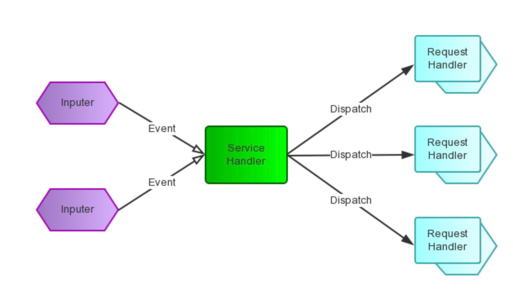

# Reactor 模型

## 简介

维基百科对 Reactor pattern 的解释：

> The reactor design pattern is an event handling pattern for handling service requests delivered concurrently to a service handler by one or more inputs. The service handler then demultiplexes the incoming requests and dispatches them synchronously to the associated request handlers.

从这个描述中，我们知道Reactor模式首先是事件驱动的，有一个或多个并发输入源，有一个Service Handler，有多个Request Handlers；Service Handler会对输入的请求（Event）进行多路复用，并同步地将它们分发给相应的Request Handler。
下面的图将直观地展示上述文字描述：

Reactor 包含三种不同的模式，下面一一介绍。

## Reactor 单线程模式

Java 中的 NIO 模式的 Selector 网络通讯，其实就是一个简单的 Reactor 模型。可以说是单线程的 Reactor 模式。

Reactor 的单线程模式的单线程主要是针对于 I/O 操作而言，也就是所有的 I/O 的 accept()、read()、write() 以及 connect() 操作都在一个线程上完成的。

但在目前的单线程 Reactor 模式中，不仅 I/O 操作在该 Reactor 线程上，连非 I/O 的业务操作也在该线程上进行处理了，这可能会大大延迟 I/O 请求的响应。所以我们应该将非 I/O 的业务逻辑操作从 Reactor 线程上卸载，以此来加速 Reactor 线程对 I/O 请求的响应。

## Reactor-工作者线程池模式

与单线程模式不同的是，添加了一个 **工作者线程池**，并将非 I/O 操作从 Reactor 线程中移出转交给工作者线程池（Thread Pool）来执行。这样能够提高 Reactor 线程的 I/O 响应，不至于因为一些耗时的业务逻辑而延迟对后面 I/O 请求的处理。

在工作者线程池模式中，虽然非 I/O 操作交给了线程池来处理，但是 **所有的 I/O 操作依然由 Reactor 单线程执行**，在高负载、高并发或大数据量的应用场景，依然较容易成为瓶颈。所以，对于 Reactor 的优化，又产生出下面的多线程模式。

## Reactor-多线程模式

对于多个 CPU 的机器，为充分利用系统资源，将 Reactor 拆分为两部分：mainReactor 和 subReactor。

**mainReactor** 负责监听 server socket，用来处理网络新连接的建立，将建立的 socketChannel 指定注册给 subReactor，通常 **一个线程** 就可以处理 ；

**subReactor** 维护自己的 selector, 基于 mainReactor 注册的 socketChannel 多路分离 I/O 读写事件，读写网络数据，通常使用 **多线程**；

对非 I/O 的操作，依然转交给工作者线程池（Thread Pool）执行。

此种模型中，每个模块的工作更加专一，耦合度更低，性能和稳定性也大量的提升，支持的可并发客户端数量可达到上百万级别。关于此种模型的应用，目前有很多优秀的框架已经在应用了，比如 mina 和 netty 等。Reactor 模式 - 多线程模式下去掉工作者线程池（Thread Pool），则是 Netty 中 NIO 的默认模式。

* mainReactor 对应 Netty 中配置的 BossGroup 线程组，主要负责接受客户端连接的建立。一般只暴露一个服务端口，BossGroup 线程组一般一个线程工作即可
* subReactor 对应 Netty 中配置的 WorkerGroup 线程组，BossGroup 线程组接受并建立完客户端的连接后，将网络 socket 转交给 WorkerGroup 线程组，然后在 WorkerGroup 线程组内选择一个线程，进行 I/O 的处理。WorkerGroup 线程组主要处理 I/O，一般设置 2*CPU 核数个线程

## Reference

[1] <https://www.zhihu.com/question/320829696/answer/916954817>
